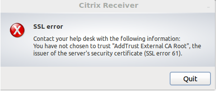

# Citrix Linux SSL Fix

This bash script will add missing certificates to the Citrix app.



## Requirements
* [`jq`](https://stedolan.github.io/jq/download/)
* [`wget`](https://www.gnu.org/software/wget/)
* [Citrix Workspace App](https://www.citrix.com/downloads/workspace-app/)

## Run

1. Clone the repo in your preferred location
   
```sh
git clone git@github.com:weareneopix/citrix-linux-ssl-fix.git
```

Open the directory `cd citrix-linux-ssl-fix`.

2. Run the bash script

```sh
bash run.sh
```

## Options

| Argument | Description                          |
| :------: | ------------------------------------ |
|   `-r`   | Refresh/re-download the certificates |

## Credits

All certificates provided by [digicert](https://www.digicert.com/kb/digicert-root-certificates.htm).